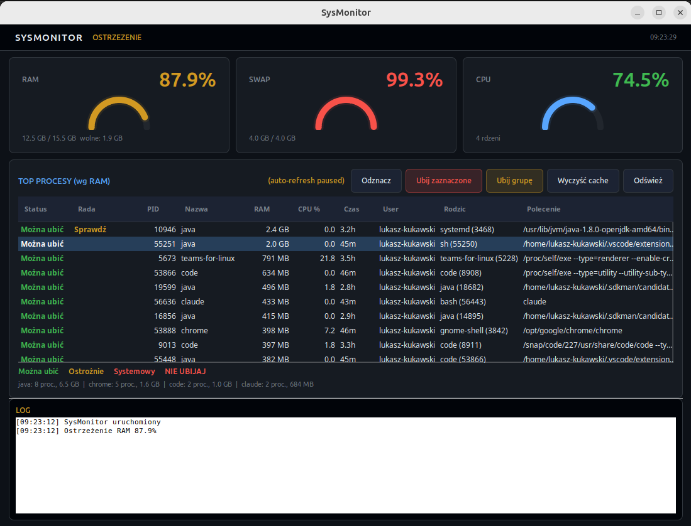

<div align="center">

# SysMonitor

**Lightweight, modern system resource monitor for Linux**

A GTK3 desktop application for real-time monitoring of RAM, SWAP, and CPU.
Alerts you when memory is running low and lets you kill processes directly from the GUI.




[Polski (PL)](README_pl.md)

</div>

---

## Features

<table>
<tr>
<td width="50%">

### Real-time monitoring
- Color-coded progress bars for RAM, SWAP, CPU
- Green = OK, Yellow = warning, Red = critical
- Configurable alarm thresholds

</td>
<td width="50%">

### Arc gauges
- Percentage arc indicators in each metric card
- Color changes based on thresholds: green > yellow > red
- Real-time updates

</td>
</tr>
<tr>
<td>

### Process list
- Top 20 processes by RAM usage
- Sortable columns: PID, Name, RAM (MB), CPU%, Time, User, Status
- Process groups (e.g. *"chrome: 12 proc., 3200 MB"*)

</td>
<td>

### Notifications & actions
- Desktop notifications (`notify-send`)
- Kill individual processes or entire groups
- Clear filesystem cache (sudo)
- Clear SWAP (sudo)
- 5 min cooldown between notifications

</td>
</tr>
</table>

---

## Requirements

| Dependency | Description | Required? |
|------------|-------------|:---------:|
| Python 3.8+ | Interpreter | Yes |
| GTK 3.0 + PyGObject | GUI framework | Yes |
| `python3-gi-cairo` | Cairo drawing (gauges) | Yes |
| `psutil` | System metrics | Yes |
| `notify-send` | Desktop notifications | Optional |

---

## Installation

<details>
<summary><b>Debian / Ubuntu</b></summary>

```bash
sudo apt install python3-gi python3-gi-cairo gir1.2-gtk-3.0 gir1.2-pango-1.0 libnotify-bin
pip install -r requirements.txt
```
</details>

<details>
<summary><b>Fedora</b></summary>

```bash
sudo dnf install python3-gobject gtk3 libnotify
pip install -r requirements.txt
```
</details>

<details>
<summary><b>Arch Linux</b></summary>

```bash
sudo pacman -S python-gobject gtk3 libnotify
pip install -r requirements.txt
```
</details>

---

## Usage

```bash
python3 sysmonitor.py
```

---

## Interface

```
+------------------------------------------------------+
|  SYSMONITOR                          * Status: OK    |
+------------------------------------------------------+
|  +----------+  +----------+  +----------+            |
|  | RAM      |  | SWAP     |  | CPU      |            |
|  | ######.. |  | ###..... |  | #####... |            |
|  | 62.3%    |  | 34.1%    |  | 47.8%    |            |
|  +----------+  +----------+  +----------+            |
+------------------------------------------------------+
|  PID   Name          RAM(MB)  CPU%  Time   User      |
|  1234  firefox        1200    3.2   01:23  user      |
|  5678  chrome          890    1.8   00:45  user      |
|  ...                                                  |
+------------------------------------------------------+
|  [Clear cache] [Clear SWAP] [Kill group] [Refresh]   |
+------------------------------------------------------+
|  LOG: 12:30 RAM 82% - warning sent                   |
+------------------------------------------------------+
```

---

## Configuration

Edit the constants at the top of `sysmonitor.py`:

```python
RAM_WARNING    = 80    # % - yellow warning
RAM_CRITICAL   = 90    # % - red alert
SWAP_WARNING   = 70    # % - SWAP warning
CHECK_INTERVAL = 3     # seconds between refreshes
NOTIFY_COOLDOWN = 300  # seconds between notifications
```

---

## Safety

- Will not kill system processes (PID < 1000), root processes, or itself
- Confirmation dialog before every kill action
- Graceful termination: `SIGTERM` > 5s wait > `SIGKILL`

---

<details>
<summary><b>Autostart (systemd)</b></summary>

```bash
mkdir -p ~/.config/systemd/user

cat > ~/.config/systemd/user/sysmonitor.service << 'EOF'
[Unit]
Description=System Resource Monitor

[Service]
Type=simple
ExecStart=/usr/bin/python3 /path/to/sysmonitor.py
Restart=on-failure
RestartSec=10
Environment=DISPLAY=:0

[Install]
WantedBy=default.target
EOF

systemctl --user daemon-reload
systemctl --user enable --now sysmonitor.service
```
</details>

---

## Contributing

Contributions are welcome! Open an issue or submit a pull request.

## License

MIT License — see [LICENSE](LICENSE) for details.
